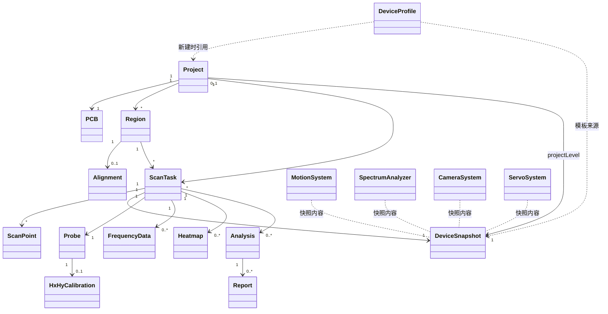

# Object Relationships — 对象关系

## 类关系图（Release 009.8）

---

## 关系文字说明

### 1. Project 与 PCB

**Project** 是磁盘上的工程文件夹与 `project.json` 所代表的**数据容器**；**PCB** 是该工程中被测的那一块板（历史文档中的 Sample）。

| 维度 | 说明 |
|---|---|
| 基数 | 1 Project : 1 PCB（ADR-0001） |
| 职责分界 | Project 管元数据（客户、操作员、路径）；PCB 管被测物（编号、版本、照片） |
| UI | Project 经**文件菜单**打开/保存；PCB 经**扫描画布**展示照片 |
| 持久化 | `project.json` + `pcb/pcb.json`（兼容旧 `sample/`） |
| 禁止 | 一个 Project 多块无关 PCB；PCB 照片不应散落在各 Region 目录 |

### 2. Project 与 Region

Project **包含**多个 Region，Region 是 Project 内可独立扫描的业务分区（CPU、WiFi 等）。

| 维度 | 说明 |
|---|---|
| 基数 | 1 : N，扫描前至少 1 个 Region |
| 职责 | Project 不保存 Region 几何；各 Region 自有 `regions/{id}/` |
| 生命周期 | Region 随 Project 文件夹移动/备份/归档 |
| UI | Region 在画布矩形 + 参数 Dock + Breadcrumb，**非** Project 一级页 |
| 禁止 | 无 Project 创建 Region；Region 跨 Project 移动 |

### 3. Region 与 Alignment

**Alignment** 描述 Region 在 PCB 图像与运动坐标之间的映射，**从属**于 Region（ADR-0005 / ADR-0019），不是独立一级业务对象。

| 维度 | 说明 |
|---|---|
| 基数 | 1 Region : 0..1 Alignment |
| 必要性 | 无 Alignment 仍可 ScanTask；有 Alignment 才可 PCB 叠加热力图 |
| 存储 | `regions/{id}/alignment.json` |
| Hx/Hy | 切换通道后，有有效偏移补偿可保持「已对齐」；否则「需重新确认」（见 Alignment 状态机） |
| 禁止 | Project 级唯一 Alignment 替代各 Region |

### 4. Region 与 ScanTask

**Region** 定义「扫哪里、怎么扫」；**ScanTask** 是某次实际采集执行。二者 **不相等**。

| 维度 | 说明 |
|---|---|
| 基数 | 1 Region : N ScanTask（Hx、Hy、重扫各一条） |
| 规则 | 重扫**新建** ScanTask，不覆盖 raw（ADR-0007） |
| 删除 | 删 Region 不得静默删 ScanTask raw；须归档或保留历史 |
| UI | Region 选区在画布；ScanTask 进度在状态栏/工具栏 |

### 5. ScanTask 与 DeviceSnapshot

每条 ScanTask 在**开始扫描时**冻结一份 **DeviceSnapshot**，记录当时运动/频谱/相机/舵机配置与版本。

| 维度 | 说明 |
|---|---|
| 基数 | 1 ScanTask : 1 DeviceSnapshot（任务级，ADR-0020） |
| 目的 | 报告复现、审计；当前设备改配置**不影响**历史 Snapshot |
| 来源 | 自 DeviceProfile 模板 + 运行时连接参数复制 |
| 禁止 | 用当前 Profile 覆盖已锁定 Snapshot |

### 6. ScanTask 与 Heatmap

**Heatmap** 由 ScanTask 的 ScanPoint 数据**派生**，与 raw 分离，可重新生成（ADR-0010）。

| 维度 | 说明 |
|---|---|
| 基数 | 1 ScanTask : 0..N Heatmap（不同 LUT/参数） |
| 渲染 | 单张 QPixmap 叠加画布，禁止逐格 Item |
| 失败 | raw 完整时 Heatmap 生成失败可重试，不删 raw |
| 叠加 | 依赖 Region.Alignment 映射到 PCB 图 |

### 7. Analysis 与 Report

**Analysis** 是对 ScanTask/Heatmap 的可重复解读；**Report** 是面向交付的导出物，引用 Analysis，**不修改**原始 ScanTask 数据。

| 维度 | 说明 |
|---|---|
| 基数 | 1 Analysis : N Report（不同模板/格式） |
| 流程 | 选结果 → 模板 → 生成 → 预览 → 导出 → 归档 |
| 禁止 | Report 回写 raw；Report 启动扫描 |

---

## 基数与约束（速查）

| 关系 | 基数 | 约束 |
|---|---|---|
| Project — PCB | 1:1 | ADR-0001 |
| Project — Region | 1:N | 扫描前 ≥1 Region |
| Region — ScanTask | 1:N | 重扫新建 |
| Region — Alignment | 1:0..1 | 属 Region |
| ScanTask — DeviceSnapshot | N:1 | 开始时冻结 |
| ScanTask — Heatmap | 1:N | 可重算 |
| Analysis — Report | 1:N | 只读引用 |

## 相关文档

- [Domain_Principles.md](Domain_Principles.md)
- [../../data/Relationships.md](../../data/Relationships.md)（历史兼容）
